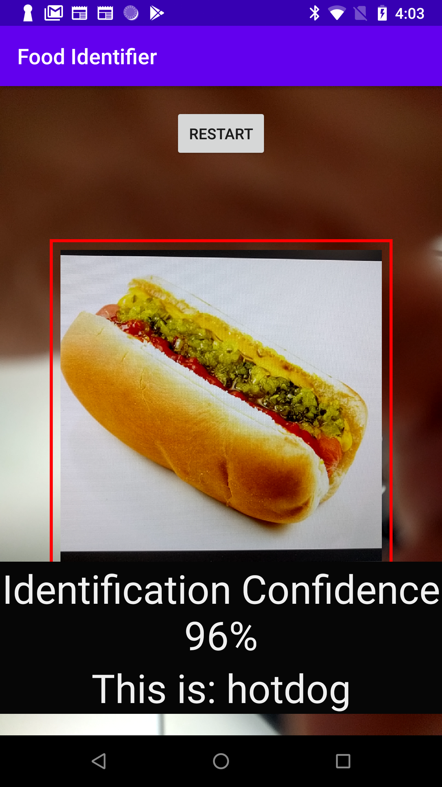

# Food Identification App
Android app to identify 451 different types of food. 
Looks like this!

## Usage
Unfortunately, the model file used cannot be uploaded to Github due to its large size (over 100 MB). To use this app yourself follow the steps below:

1. Download the [Food-475 dataset](http://www.ivl.disco.unimib.it/activities/food475db/). That means downloading the 4 separate datasets. You may have to email a professor for the Food-101 dataset. However, Food-50 was not available, and there was no point of contact. By not using Food-50, there are only 451 types of food, not 475.
2. When following the train/test split given, remove Food-50 references. This may create a bias, as some food classes are now missing some data. In particular, Food-50 seemed to have contained many images for Asian foods. 
3. Edit the lines in [food_training.py](food_training.py) that reference training/testing/output directories. 
4. Run program with `python food_training.py -e X`, where X is number of epochs to train for. I recommend 40+ epochs.
5. Copy latest weight file (with .hdf5 extension) into [assets](android_app/app/src/main/assets/). 
6. Open program in Android-Studio, download and install onto phone.

### Caveats/Notes
- UI is a bit ugly in my taste, but not a high priority for me. You can change UI elements easily in Android-studio.
- Some labels are cut off or have no space between words if they are long like "boiledfishwithpickledcabbageandchili". This was given in the dataset and rewriting the labels was not a priority.
- Doesn't work well on Asian foods. Possibly because of all the missing data from Food-50. However, I did get 96% accuracy and 86% validation accuracy in training. 

## Not interested in Food? You can still apply to this other classification tasks!
Checklist of things to do:
- Make sure you're using **Tensorflow 1.14.0**. I haven't completely upgraded to Tensorflow 2.0 yet.
- Train your model with your dataset. You can convert to a tflite using [converter.py](converter.py). 
- Rename variables/functions
- In FoodIdentifier.kt, in the function at bottom, change the array size to how many classes you have
- Create a hashmap that maps index to food. In Keras, flow_from_directory orders sub-directories alphabetically, so you can easily make a function to do this. I stored this data in a csv, and placed in res/raw (assets didn't work for me even though I added noCompress "csv" in app gradle file). 
- Change UI elements

#### Credits
Learned from [Mateusz Dziubek](https://android.jlelse.eu/the-least-you-can-do-with-camera2-api-2971c8c81b8b) for Android-Studio stuff and [stratospark](https://github.com/stratospark/food-101-keras) for training. 
